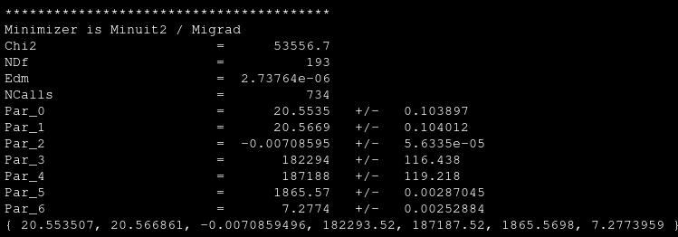

## Mon 12/06/2023

I have spent the day reading the MPhys reports as well as the analsysis-essentials resource.

## Tue 13/06/2023

Similar to yesterday. In addition I have installed relevant packages locally (such as uproot and ROOT).
I couldn't manage to install root\_pandas due to issuses with the root\_numpy package. I tried using mamba instead of conda as the package manager but that didn't work either.

## Wed 14/06/2023

Received the CERN computing account. Spent the morning setting it up. Tried to connect to lxplus using SSH however received the error

```
Connection closed by 188.185.7.79 port 22
```

This is most likely because I'm currently part of the default computing group (def-cg) and I need to be part of the LHCb computing group (z5). This has been requested and I am currently waiting. SWAN works correctly and I have been able to connect to mattermost and CERNbox as well.

## Thu 15/06/2023

The computing group has now been updated and it is now possible to connect to the lxplus server using the command

```
ssh -Y USERNAME@lxplus.cern.ch
```

I had access to the code by Michael and Milly. I cloned their repository into my SWAN projects.

First of all I tried to run their cut_data.py script which is used to select the events. IN order to do this I used the small dataset at first. The only issue with this script was that the files were hardcoded to be written to their SWAN accounts for which I obviously don't have the required permissions. After fixing the path the code run successfully and produced the expected output.
I then proceeded to run the script all\_models\_small.py with the flags --year 18 --polarity up --meson D0 --model 1. As an output I received the fitting as expected. However a lot of warning messages were printed to the terminal, which at the moment I don't quite know their origin.
Then I use the final_models.py script running it using models 2 and 14 for both D0 and D0bar and for both polarities up and down. The graph produced for D0 using model 14, is exactly the same as presented in the MPhys report. Therefore, it has been reproduced successfully. The idea of using these models is so that I can then calculate the production assymmetry as dones in the report, and check if the results are reproducible as expected.
After doing this, I run the script asymmetriesblind.py and obtain the output

```
The 2016 asymmetry is: -0.55 +/- 0.21 (stat) +/- 0.01(sys) %
```

This is exactly as presented in the semester 1 mphys project report. Therefore, I have been able to replicate their results successfully.

Ideas on what can be done:

- Improve selection cuts
- Try improve fitting data after selection
- Study production asymmetry using binning

## Fri 16/06/2023

I have decided that the objective will be to try and measure the production asymmetries in different regions of the phase space oh the decaying d0 meson. To do this the selection cuts, detection asymmetry mesures, fitting procedures, ... should be revised. However initially I will take the work of Michael and Milly and avoid doing it myself and just focus on the 2D space. IIf I then have time I will revise these important details to improve my work. The first step though is refining their code and making it so that I feel comfortable using it.

### selection\_of\_events.py

This script will be based on their script cut_data.py. The main features I want to add it is argparse so that the sata to be looked at can be stated when running the code instead of having to manually unhash the data to be looked at. I also want to make it possible to pass as an argument the path where the files should be saved at. This is so that the necessary path doesn't need to be hardcoded as it is at the moment, and the code becomes more flexible.

**Objectives**

- [x] Make it possible to select the data by passing arguments
- [x] Make it possible for the path to be passed as an argument
- [x] Update the code with all the cuts that where decided in semester 2

The first thing that I did to the initial code so that it follows the usual structure: import statements, functions, main body. I also added a docstring at the beginning to explain the basics of what the code does as well as stating the author and date of last modification.
After that I added the argparse module and created the functionality to choose the year and size of the data to be analysed by passing an argument when running the code. In the initial code the same piece of code was copied 6 times with minor modifications for each of the possible combinations of year and size. After the modification this has been eliminated and the code has become much more flexible.
I used the argparse module to crweate a flag to input the path where the output files should be written. It is an optional flag, and in case it is not use the files are written to the current working directory. There is also a validation to make sure that the argument given really is a path to a directory. Apart from that I have put most of the implementation of the main code inside sepearte functions so that the main code is cleaner and easier to understand.
The code at this stage needs many docstrings as most of the code has just been thrown into functions without creating these. Also the description in the header needs to be updated.
After this I looked at the code of the second semester where the new selection criteria was added. The addition where only three lines of code which have been added to the cut_data function.
Another change implemented to the code to add flexability is that instead of having two different bits of code to import small and large datasets, one using uproot.open and the other uproot.concatenate, this is merged in one bit of code that uses concatenate for all the sizes. This makes the code run slightly slower for small as the concatenate method is slower. 3 sizes are estipulated by default:

- small: it takes only 200.000 events
- medium: takes 4 root files worth of data
- large: takes 8 root files worth of data

Exploiting the fact that at the moment the code is much more flexible, another functionality added is that for the flag --size an integer can be passed as an argument. This integer must be a value between 1 and 8. This integer is taken to be the number of root files to be read in as input data.
Finally, I write the necessary docstrings and comments that were omitted earlier, as well as the description of the code. After this step the code is fully polished and has all of the required functionality.

## Mon 19/06/2023

The next file needed for the analysis from Michael and Milly is multiple_candidates.py to remove at random events with multiple candidadates, so that only one candidate survives.

### multiple_candidates.py

In this case the codes is much better structured and commented. the path is still hard coded. The things I intend to change is the path, put the arg parser in a function and comment the whole code.
I have implamented the path flag and restructured the code and it now works successfully.

### automated.sh

Before proceeding to fit the data I will create a sh file so that the process is automated and we are not required to constantly type in the commands for each meson and polarity. This file is named **automated.sh** and uses 2 for loops to iterate over all the needed combinations of msons and polarity to process the whole data outputed by selection_of events.
It first calls selection\_of\_events and outputs the files to a given directory, then iterates over all these files to remove multiple candidates, saving the output in this same directory.

### model_fitting.py

Now I move on to fitting the data. I use the code by milly and michael as a base again here. This code seems quite messy and needs a lot of cleaning. Apart from that at several places it seems like the fitting functions need very specific initial values or other they don't converge, this is something I will have to focus on as well.
**Objectives**

- [x] Implement flexible path
- [x] Organise code into functions
- [x] Comment the code
- [x] Modify automated.sh to include fitting_models.py

I have added the functionality to pass the path as an argument when running the code. I have then organised the code in functions as there were none. The first function is the usual argument parser function. Then I created a function for each of the models used for fitting the models are:

- Crystal Ball + Gaussian / Chebychev
- Gaussian + Gaussian / Chebychev
- Bifurcated Gaussian + Gaussian / Chebychev
- Johnson SU + Gaussian / Chevychev

The main code decides which one of these must be called depending on the user input. It then writes the needed values for further analysis to the same path in a .txt file. The relevant figures are also given as output in the same directory. The code now works correctly, it only needs to be properly commented.
The automated.sh file has been updated as well to include 3 nested for loops which iterate over all datasets that need to be fitted for further analysis. This has also been tested and works as expected.
The code has now been completely commented. However I now realized that the output .txt file has not been properlly formatted so that it can then be easily to read. I will fix this now. I have fixed it so that it can easily be used in the next file. However I want to explore if there is a better way to format this output in the future.

### calculate_asymmetry.py

In this case the file of Michael and Milly was not as good as before. For this reason I decided to write the script from scratch and only copy and paste the few parts that could be usable.
This code takes the input produced by the previous script and uses this input to calculate the raw asymetries, and also assess the systematic uncertainties using the output from a second model. The detector asymmetries are also calulated but it uses a hard-computed input that comes from Michael and Milly work. An improvement could be to add a feature to read this values from a file instead of being hard-computed in the code. The script then outputs the result both to the sccreen and to a .txt file. This script was tested and behaves as expected. The only thing left is for me to write the comments. This code is now also being called in the automated.sh script, so that this script is now complete, and calls all the necessary scripts to produce the desired output.
The main iisue that is left is that the time it takes to run all of this code is very high, and when calling large as the size to be analysed it doesn't even work. This is something I have to investigate.
The comments have now been written, even though they could probably be improved.

## Tue 20/06/2023

Now that the whole code is up and running I'm interesten in laying out the path to follow during the next 5 weeks. Meanwhile I analyse the large sets of data to try to replicate the results of Michael and Milly.

**Steps to follow**

- Selection Criteria
- Span Phase space and select binning scheme
- Data fitting
- Detection Asymmetries
- Obtain A_prod distribution and integrated value
- Assess systematics

At first I will assume the selection criteria already in place to be right (in further studies this could be verified and improved). Therefore the first thing that needs to be done is to span the phase space and decide on the binning scheme. The fitting procedure will then have to be adjusted and the raw asymmetries will be obtained. I want to try a Cruijff function for this as well as the current Crystal Ball + Gaussian. The detection asymmetries will then be the next major step, as these weill probably have to be assessed at each of the individual bins. Once these have been obtained, the production asymmetry will readily be obtained as well as tghe distribution and integrated value.
Finally in the end the systematics should be carefully analysed, and the selection criteria could be revised at this point as well in order to produce a complete analysis.
The first step was to plot a 2D histogram of the events, with transverse momentum in one axis and pseudorapidity in the other. It took me a while to figure out how to do this in PyROOT, but I finally managed to do it. THe result obtained is the following:

[result.pdf](../_resources/result.pdf)

This is using only one small set of data and fixing the pT to be less than 10 GeV/c. Beyond this momentum there are not as many events and the significance of any region would have been much smaller.

## Wed 21/06/2023

Here I had to choose a binning scheme in order to divide the 2D histogram in regions of similar frequency. To do this I decided to use a binning scheme which was independent in the x axis from the y axis. What this does is it only looks at the transeverse momentum at first and divides the events in 10 bins of equal frequency. It then does the same for pseudorapidity. This method obviously doesn-t achieve exactly the same frequency in each bin but is a good starting point.
To implement this I used the library Pandas as well as PyRoot and I obtained the following:

[result_binned.pdf](../_resources/result_binned.pdf)

As we can see there isn't a complete uniformity between all the bins, as one could already have expecte. However we can see that most of the bins do have a similar frequecy and it is only those closer to the corners the diverge. The data shown in these plots id for D0 decays using the up polarity with thata from 2018.
Once the binning scheme has been decided the next step is to fit the events in each bin. For this the code of the script model_fitting.py was slightly changed so that it iterates over all the bins and so it fits the data in all local regions. After a small trial of this the results obtained are the following:

[D0\_up\_17\_large\_bin10\_model1\_ANA.pdf](../_resources/D0_up_17_large_bin10_model1_ANA.pdf)

[D0\_up\_17\_large\_bin24\_model1\_ANA.pdf](../_resources/D0_up_17_large_bin24_model1_ANA.pdf)

These plots show data from 2017 using the D0 meson in the up polarity.

## Thu 22/06/2023

I tried to completely run all the code up until now as this far I had only used it in smaller samples in order to make sure it worked.
However, on my first attempt to run the code, it crashed. It presented Traceback errors when trying to use the Awkward Library. The issue persisted in multiple of my scripts. After a whole morning changing the code and trying to go around all of these errors, I leaned that the issue was becaus I was using uproot.open() in order to read in the data from the .root files, as soon as I used uproot.concatenate() the errors were resolved and the code runned correctly. As at this time I didn't have enough time for the code tu run entirely, I only run the scripts up until the bins are formed and the events in each bin are written to a .root file.

## Fri 23/06/2023

I tried to run the model fitting code, however this bit of code was extremely slow. Meanwhile I started writing the script calculate\_raw\_asymmetry.py, inspired in the code calculate_asymmetry.py. This code takes the yields of each meson and polarity in each bin and calculates the raw asymmetry in each bin. It then outputs this raw asymmetry to a .txt file. I want to create a bit of code that can read these .txt files, compute the integrated asymmetry, plot the asymmetries in the 2D histogram, and create 1D histogram tho show the distribution of the asymmetries (and assess if this distribution is indeed Gaussian as one would expect).
However, I intendeadly killed the running code while it was more than 3 hours in, meaning that again I wouldn't have time to run the whole code again. I experimented with both lxplus and the UNIX shells within lxplus, but neither of them worked any faster than SWAN already was. So I decided to leave the code execution for monday and focus on the literature.

## Mon 26/06/2023

First thing I do is start running the whole code up until now using the 2017 data.
There are several things that need to be improved of my code that I have realised. First of all regarding the binning scheme to **achieve a equal frequency binning scheme** I can divide the transverse momentum axis in bins of equal frequency. Instead of doing the same for the pseudorapidity axis independently of transverse momentum, I could do the equal frequency binning in each of the transverse momentum bins, meaning that in a single transverse momentum bin all the sub bins will have the same frequency, and therefore all the subbins across the 2D histogram will have the same frequency. Apart from that, another required improvement to the bins is that I was doing the binning independently for each polarity and meson, however if the bins are different for each of them I can't realy combine the results to obtained the final value of raw asymmetry. Therefore what I will do is **take into account all events in order to decide the binning scheme**, and this way the bins will be uniform across both polarities and mesons.
Another issue detected is the following. When measuring the global asymmetries with the signal model formed by A Crystal Ball Function and a gaussian distribution, the Crstal ball always had a much higher amplitude, and the gaussian acted more lika a correction, however, in some of the local regions as it can be seen in some figures above, thelack of data sometimes make their roles change, and in some cases the Crystal Ball is very odly shaped. A possible fix to this is to actually fix all the parameters but the normalization constant. To do this I will want to fit the global events and **obtain the best set of parameters and then use these for the local regions**.
Another option would be to change the signal model. One option would be the Cruiff function. However, this is not necessary now and can easily be modifiied in the future. A way to assess the difference from one model to the other is to use one to generate a set of events (a toy model), and use the other to fit this toy model, and see how well it actually does.
To make clear all the steps, and how the different pieces of code should be connected to one another, I have drawn the following scheme:

[Adobe Scan 26 Jun 2023.pdf](../_resources/Adobe Scan 26 Jun 2023.pdf)

The first step is to change minor details of the selection of events phase. First of all, I don't want the selection\_of\_events.py to discriminate based on the decaying meson. This is beacuse then when I want to get rid of multiple candidates, there might be some multiple candidates that have been split in different datasets and are not handled. **THIS MIGHT INTRODUCE UNCERTAINTY IN THE MESURED ASYMMETRY! DISCUSS WITH EVA**. Then the multiple_candidates.py, after cleaning the data, does create a dataset containing only events of each meson (D0/D0bar). These changes have been applied ant it works as expected.
The next step is to create the binning scheme. I have edited the script create\_bins.py, renaming it create\_binning\_scheme.py. It now applies the aforementioned algorithm to ensure a constant frequency across all bins, and then outputs the bin edges to the file year\_size_bins.txt. At first I added to the code the feature to print the number of events in each bin, to ensure that the code works as intended. The result was indeed that each bin contained exactly the same amount of elements (142331 using the large set from 2018). Note that these still need to be splitaccording to the meson and polarity, so assuming they are evenly distributed (which they are NOT), we would have rouhly 35500 events in each bin to be fitted.
The next step is to use the outputed bins in order to divide the data for each polarity and meson. This is again done by modyfying the code in create\_bins.py. The new code is in the script apply\_binning\_scheme.py. This writes the events in each bin to a root file with the name meson\_polarity\_year\_size\_binXX.root. The implementation is quite straight forwars and it does work.In order to check the exact number of events in each bin, the number of events are written to an array which is the written to the file number\_of\_events\_meson\_polarity\_year\_size.txt. Using the D0 decay and the up polarity with the large 2018 data, I obtain that the number of events in each bin is around 36.000 events. The maximum is 36579, and the minimum is 35376.touch plot\_phase_space.py.
WHen applying this to the whole data we find:
**D0 up:**
The maximum events in a bin is 36579
The minimum events in a bin is 35376
**D0bar up:**
The maximum events in a bin is 37452
The minimum events in a bin is 36406
**both up:**
The maximum events in a bin is 73588
The minimum events in a bin is 72332
**D0 down:**
The maximum events in a bin is 35113
The minimum events in a bin is 33673
**D0bar down:**
The maximum events in a bin is 35897
The minimum events in a bin is 34559
**both down:**
The maximum events in a bin is 69906
The minimum events in a bin is 68668

The next step, and final for today, is to plot a 2D histogram with all the events, and draw the bins as well. Plotting all the events in the 2D histogram (using up polarity, D0 meson) the result obtained is:

[2D\_histogram\_no\_bins\_extended\_D0\_up\_18\_large.pdf](../_resources/2D_histogram_no_bins_extended_D0_up_18_large.pdf)

Limitting this to a transverse momentum lower than 10 GeV/c, which is the same restriction used to calculate the bins we obtain:

[2D\_histogram\_no\_bins\_D0\_up\_18_large.pdf](../_resources/2D_histogram_no_bins_D0_up_18_large.pdf)

The next step is to plot the bins, there is no easy way to do this, but over impressing the lines of the bin edges the result obtained is the following:

[2D\_histogram\_bins\_D0\_up\_18\_large.pdf](../_resources/2D_histogram_bins_D0_up_18_large.pdf)

Here I have limited the x axis to be between 1.5 and 10.

## Tue 27/06/2023

I have done the 2D histogram for the rest of events getting the following results:
**D0bar up:**

[2D\_histogram\_bins\_D0bar\_up\_18\_large.pdf](../_resources/2D_histogram_bins_D0bar_up_18_large.pdf)

**both up:**

[2D\_histogram\_bins\_both\_up\_18\_large.pdf](../_resources/2D_histogram_bins_both_up_18_large.pdf)

**D0 down:**

[2D\_histogram\_bins\_D0\_down\_18\_large.pdf](../_resources/2D_histogram_bins_D0_down_18_large.pdf)

**D0bar down:**

[2D\_histogram\_bins\_D0bar\_down\_18\_large.pdf](../_resources/2D_histogram_bins_D0bar_down_18_large.pdf)

**both down:**

[2D\_histogram\_bins\_both\_down\_18\_large.pdf](../_resources/2D_histogram_bins_both_down_18_large.pdf)

The next step is to get the fitting parameters from the global fit, to use them in the local fits. To do this a simultaneous fit of both up and down polarities and D0 and D0bar meson will be used. This requires ROOT and the previous model_fitting.py script used uproot, so this will make it a bit more complex. After writting the code, using an exponential and a gaussian instead of the right model for simplicity, it keeps raising a segmantation error.
Apart from solving this error, other things that still need to be done are changing background to chebyhev, adding crystal ball, setting the limits on the different parameters.

## Fri 30/06/2023
The esegmentation fault in the code has been very difficult to get rid of. It is in the Chi2Function method. After a long time of changing things in the end I have been able to solve it. However, new errors still persist. The error is when using the FitFCN function, which prints an error message saying that there is no implementation that accepts the arguments passed. However, the arguments passed are exactly the same as in the example code. I have not yet been able to solve this error in the code.

## Sat 01/07/2023
I have decided to try to only fit 2 sets of events at a time instead of 4. I have adapted the code to only take events of one polarity, and therefore both polarities will need to be fit seperately. After doing so and running the code, the previous error has finally been solved and a best set of parameters is obtained. The outcome is the following:




This parameters are not really that important, and we can see that the chi squared is really off, because the model used here is the simple model of an exponential and a Gaussian, which we already know it's not the right model we are interested in.
The next steps is to output the best fit parameters to a txt file so that they can later be read-in in other files and used. Then I need to change the model to the model formed by a Chebychev, a Crystall Ball and a Gaussian. Finally I might need to add some boundaries to the values we expect of the parameters so that the fit does not converge in some non physical solution.
The feature of printing the paramters has been correctly added. The model has been changed, but the error when calling FitFCN has come back once again. At this moment I think that the issue might have to do with the number of parameters.

## Sun 02/07/2023
I have changed the simultaneous fitting procedure to use RooFit. After doping so finally the code works correctly. It is capable of fitting the 4 sets of data at the same time, obtaining the following best fit values:
mean = 1.865644451309209899e+03
sigma = 6.181059303370978419e+00
Cmu = 1.864921802192138784e+03
Csigma = 1.010486620370557631e+01
aL = 1.661802211878358193e+00
nL = 9.568919068372835568e+00
aR = 4.266195240609256700e+00
nR = 9.705844147670141808e+00
frac = 6.825295637945272276e-01
a0 = -3.517552464114945820e-01
This parameters are written to the file fit_parameters.txt. Then these are imported into the script model_fitting.py, and are used in order to fit the local events. The only values allowed to vary is the normalization constant for the signal and the background. Some examples of this are the following:


[D0_down_18_large_bin53_model1_ANA.pdf](../_resources/D0_down_18_large_bin53_model1_ANA.pdf)


[D0_down_18_large_bin26_model1_ANA.pdf](../_resources/D0_down_18_large_bin26_model1_ANA-1.pdf)


[D0_down_18_large_bin02_model1_ANA.pdf](../_resources/D0_down_18_large_bin02_model1_ANA.pdf)

As it can be seen in some of the bins with a larger number of events this does work as expected, but in others it doesn't quite fit the data correctly. An improvement to this could be to allow frac to vary as well. IN this new model the best fit parameters are the following:

mean = 1.865640007274070058e+03
sigma = 6.182647753160286364e+00
Cmu = 1.864939151710033229e+03
Csig = 1.008949771892803149e+01
aL = 1.664743593019860413e+00
nL = 9.151097773847972405e+00
aR = 4.247569150216909506e+00
nR = 9.968210749370744139e+00
a0 = -3.494330144717041620e-01

Using this and allowing frac to vary, some of the results for the local regions look like this:


[D0_down_18_large_bin53_model1_ANA.pdf](../_resources/D0_down_18_large_bin53_model1_ANA-1.pdf)


[D0_down_18_large_bin26_model1_ANA.pdf](../_resources/D0_down_18_large_bin26_model1_ANA.pdf)


[D0_down_18_large_bin02_model1_ANA.pdf](../_resources/D0_down_18_large_bin02_model1_ANA-1.pdf)


In this case we can see that the results look much better, even though they are still not perfect. We can see that the more data the better the fit seems to be.

Using the yields from this analysis, we calculate the raw asymmetries in the local regions and plot them in a 1D histogram that looks as follows: 

[1D_asymmetry_distribution.pdf](../_resources/1D_asymmetry_distribution.pdf)

The weighted mean obtained from these is: -1.28 +/- 0.03

The next steps to improve all this analysis are the following:
**- 2D histogram of asymmetries**
- 2D histogram of chi
- 1D histogram of chi
- chi vs # of events
- Plot global fits
        for meson i)
                chi2[dataset] = np.append(chi2[dataset], yields[4])
                dataset += 1
				
The result of the 2D distribution of raw asymmetries is the following: 

[2D_asymmetry_distribution.pdf](../_resources/2D_asymmetry_distribution.pdf)

The results for the 2D reduced chi squared distribution are the following:

[2D_chisquare_distribution_D0_up_18_large.pdf](../_resources/2D_chisquare_distribution_D0_up_18_large.pdf)

[2D_chisquare_distribution_D0_down_18_large.pdf](../_resources/2D_chisquare_distribution_D0_down_18_large.pdf)

[2D_chisquare_distribution_D0bar_up_18_large.pdf](../_resources/2D_chisquare_distribution_D0bar_up_18_large.pdf)

[2D_chisquare_distribution_D0bar_down_18_large.pdf](../_resources/2D_chisquare_distribution_D0bar_down_18_large.pdf)

The 1D distributions are as follows:


[1D_chisquare_distribution_D0bar_up_18_large.pdf](../_resources/1D_chisquare_distribution_D0bar_up_18_large.pdf)


[1D_chisquare_distribution_D0bar_down_18_large.pdf](../_resources/1D_chisquare_distribution_D0bar_down_18_large.pdf)


[1D_chisquare_distribution_D0_down_18_large.pdf](../_resources/1D_chisquare_distribution_D0_down_18_large.pdf)


[1D_chisquare_distribution_D0_up_18_large.pdf](../_resources/1D_chisquare_distribution_D0_up_18_large.pdf)


Looking at this data it can be seen that the model has indeed improved. BUt there still are many regions of large chi squared, and looking at the pulls it can be seen it doesn't still fit it quite well.
Therefore different combinations of parameters to be fitted will be tested to check how the chi squared distributions vary. This is done using 2017 data.
### Model 1: Gsig & Csig


[2D_chisquare_distribution_D0bar_up_17_large.pdf](../_resources/2D_chisquare_distribution_D0bar_up_17_large-4.pdf)


[2D_chisquare_distribution_D0bar_down_17_large.pdf](../_resources/2D_chisquare_distribution_D0bar_down_17_large.pdf)


[2D_chisquare_distribution_D0_up_17_large.pdf](../_resources/2D_chisquare_distribution_D0_up_17_large-3.pdf)


[2D_chisquare_distribution_D0_down_17_large.pdf](../_resources/2D_chisquare_distribution_D0_down_17_large-2.pdf)


[1D_chisquare_distribution_D0bar_up_17_large.pdf](../_resources/1D_chisquare_distribution_D0bar_up_17_large-5.pdf)


[1D_chisquare_distribution_D0bar_down_17_large.pdf](../_resources/1D_chisquare_distribution_D0bar_down_17_large.pdf)


[1D_chisquare_distribution_D0_up_17_large.pdf](../_resources/1D_chisquare_distribution_D0_up_17_large-2.pdf)


[1D_chisquare_distribution_D0_down_17_large.pdf](../_resources/1D_chisquare_distribution_D0_down_17_large-5.pdf)


### Model 2: Csig, Gsig & aL


[2D_chisquare_distribution_D0bar_up_17_large.pdf](../_resources/2D_chisquare_distribution_D0bar_up_17_large.pdf)


[2D_chisquare_distribution_D0bar_down_17_large.pdf](../_resources/2D_chisquare_distribution_D0bar_down_17_large-4.pdf)


[2D_chisquare_distribution_D0_up_17_large.pdf](../_resources/2D_chisquare_distribution_D0_up_17_large-4.pdf)


[2D_chisquare_distribution_D0_down_17_large.pdf](../_resources/2D_chisquare_distribution_D0_down_17_large-3.pdf)


[1D_chisquare_distribution_D0bar_up_17_large.pdf](../_resources/1D_chisquare_distribution_D0bar_up_17_large-1.pdf)


[1D_chisquare_distribution_D0bar_down_17_large.pdf](../_resources/1D_chisquare_distribution_D0bar_down_17_large-5.pdf)


[1D_chisquare_distribution_D0_up_17_large.pdf](../_resources/1D_chisquare_distribution_D0_up_17_large-4.pdf)


[1D_chisquare_distribution_D0_down_17_large.pdf](../_resources/1D_chisquare_distribution_D0_down_17_large-3.pdf)


### Model 3: Csig, Gsig & nL


[2D_chisquare_distribution_D0bar_up_17_large.pdf](../_resources/2D_chisquare_distribution_D0bar_up_17_large-1.pdf)


[2D_chisquare_distribution_D0bar_down_17_large.pdf](../_resources/2D_chisquare_distribution_D0bar_down_17_large-1.pdf)


[2D_chisquare_distribution_D0_up_17_large.pdf](../_resources/2D_chisquare_distribution_D0_up_17_large-1.pdf)


[2D_chisquare_distribution_D0_down_17_large.pdf](../_resources/2D_chisquare_distribution_D0_down_17_large-5.pdf)


[1D_chisquare_distribution_D0bar_up_17_large.pdf](../_resources/1D_chisquare_distribution_D0bar_up_17_large-3.pdf)


[1D_chisquare_distribution_D0bar_down_17_large.pdf](../_resources/1D_chisquare_distribution_D0bar_down_17_large-4.pdf)


[1D_chisquare_distribution_D0_up_17_large.pdf](../_resources/1D_chisquare_distribution_D0_up_17_large.pdf)


[1D_chisquare_distribution_D0_down_17_large.pdf](../_resources/1D_chisquare_distribution_D0_down_17_large-1.pdf)


### Model 4: Csig, Gsig, aL & nL


[2D_chisquare_distribution_D0bar_up_17_large.pdf](../_resources/2D_chisquare_distribution_D0bar_up_17_large-2.pdf)


[2D_chisquare_distribution_D0bar_down_17_large.pdf](../_resources/2D_chisquare_distribution_D0bar_down_17_large-2.pdf)


[2D_chisquare_distribution_D0_up_17_large.pdf](../_resources/2D_chisquare_distribution_D0_up_17_large-5.pdf)


[2D_chisquare_distribution_D0_down_17_large.pdf](../_resources/2D_chisquare_distribution_D0_down_17_large-4.pdf)


[1D_chisquare_distribution_D0bar_up_17_large.pdf](../_resources/1D_chisquare_distribution_D0bar_up_17_large.pdf)


[1D_chisquare_distribution_D0bar_down_17_large.pdf](../_resources/1D_chisquare_distribution_D0bar_down_17_large-2.pdf)


[1D_chisquare_distribution_D0_up_17_large.pdf](../_resources/1D_chisquare_distribution_D0_up_17_large-1.pdf)


[1D_chisquare_distribution_D0_down_17_large.pdf](../_resources/1D_chisquare_distribution_D0_down_17_large.pdf)


### Model 5: aL, nL, aR & nR


[2D_chisquare_distribution_D0bar_up_17_large.pdf](../_resources/2D_chisquare_distribution_D0bar_up_17_large-3.pdf)


[2D_chisquare_distribution_D0bar_down_17_large.pdf](../_resources/2D_chisquare_distribution_D0bar_down_17_large-5.pdf)


[2D_chisquare_distribution_D0_up_17_large.pdf](../_resources/2D_chisquare_distribution_D0_up_17_large-2.pdf)


[2D_chisquare_distribution_D0_down_17_large.pdf](../_resources/2D_chisquare_distribution_D0_down_17_large.pdf)


[1D_chisquare_distribution_D0bar_up_17_large.pdf](../_resources/1D_chisquare_distribution_D0bar_up_17_large-2.pdf)


[1D_chisquare_distribution_D0bar_down_17_large.pdf](../_resources/1D_chisquare_distribution_D0bar_down_17_large-1.pdf)


[1D_chisquare_distribution_D0_up_17_large.pdf](../_resources/1D_chisquare_distribution_D0_up_17_large-5.pdf)


[1D_chisquare_distribution_D0_down_17_large.pdf](../_resources/1D_chisquare_distribution_D0_down_17_large-2.pdf)


### Model 6: Everything varies but the mean

[1D_chisquare_distribution_D0_down_17_large.pdf](../_resources/1D_chisquare_distribution_D0_down_17_large-4.pdf)


[1D_chisquare_distribution_D0_up_17_large.pdf](../_resources/1D_chisquare_distribution_D0_up_17_large-3.pdf)


[1D_chisquare_distribution_D0bar_down_17_large.pdf](../_resources/1D_chisquare_distribution_D0bar_down_17_large-3.pdf)


[1D_chisquare_distribution_D0bar_up_17_large.pdf](../_resources/1D_chisquare_distribution_D0bar_up_17_large-4.pdf)


[2D_chisquare_distribution_D0bar_up_17_large.pdf](../_resources/2D_chisquare_distribution_D0bar_up_17_large-5.pdf)


[2D_chisquare_distribution_D0bar_down_17_large.pdf](../_resources/2D_chisquare_distribution_D0bar_down_17_large-3.pdf)


[2D_chisquare_distribution_D0_up_17_large.pdf](../_resources/2D_chisquare_distribution_D0_up_17_large.pdf)


[2D_chisquare_distribution_D0_down_17_large.pdf](../_resources/2D_chisquare_distribution_D0_down_17_large-1.pdf)


Things still to do:
- Calculate final asymmetry
- Include detection asymmetry code to automated bash script
- Write Code documentation
- Write readme+ 